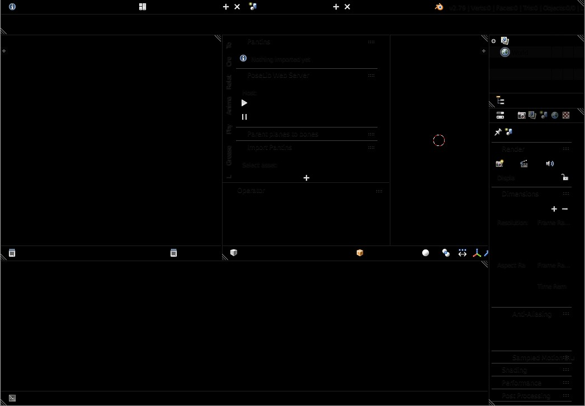

# Blender Connard Theme

A very legible theme for Blender

#### This is how to activate the theme:
* In the Themes tab of Blender’s user preferences, Click _Install…_
  and select connard.xml whence you downloaded it.

#### And this is what it looks like:


### If you want to generate your very own Connard theme
1. Save the current theme by clicking the `+` icon next to Presets in
the Themes tab of Blender’s user preferences. Choose an appropriate
name, such as _tmp_
2. The theme will be saved in your Blender directory, under `blender/2.xx/scripts/presets/interface_theme/tmp.xml`.
2. In a Unix-like shell, `cd` into that directory and run:
``` sh
sed -e 's/"#[0-9a-f]*"/"#00000000"/g' -e 's/shadow="[0-9]"/shadow="0"/g' -e 's/points="[0-9]*"/points="0"/g' -e 's/roundness="[0-9\.]*"/roundness="0.0"/g' -e 's/\(shadetop\|shadedown\).*/\1="0"/g' tmp.xml > connard.xml
rm tmp.xml
```
