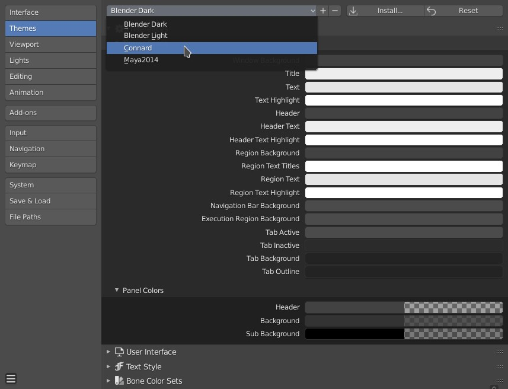

# Blender Connard Theme

A very legible theme for Blender

#### This is how to activate the theme:
* Add connard.xml to
your-blender-config/scripts/presets/interface_theme/, and then:

#### And this is what it looks like:

